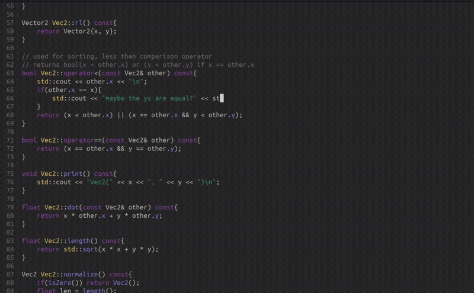

<div align="center">


    
# BingVim


A minimal modal TUI text editor written in C++ using ncurses.


<div align="center">
    
</div>

</div>

BingVim is a lightweight text editor inspired by Vim, featuring the core modal editing concepts i.e. different modes for editing text, navigation, and selection.
The goal was to explore the data structures underlying a more fully featured text editor and to learn the ncurses library for my future C++ TUI endeavours.

---

## Features
### File Reading and Writing
- Reading and writing files within the command line

### Modal Editing
- Normal mode for navigation
- Insert mode for editing text
- Command mode for entering commands for writing to file and quitting

### Undo/Redo Tree
- All edits are broken into fundamental operations (e.g. insert, delete, split line, join line)
- Undo and Redo operate on 'commited' edit sequences
- An Undo Tree navigation panel for navigating different branches

### Viewport and Scrolling
- Vertical and horizontal scrolling with configurable scroll buffers

### Smart Indentation
- Automatic indentation when creating new lines
- Basic brace aware indentation logic

### Tab Alignment
- Tabs are expanded into spaces
- Configurable tab size

### Syntax Highlighting
- Regex based highlighting for:
    - keywords
    - strings
    - numbers
    - comments
    - functions
    - member variables

---

## Usage
Open a file to edit:
```bash
./bingvim filepath
```

---

## Keybindings
### Normal Mode

| Key | Action |
|----|----|
| `h` | Move cursor left |
| `j` | Move cursor down |
| `k` | Move cursor up |
| `l` | Move cursor right |
| `i` | Enter insert mode before cursor |
| `a` | Enter insert mode after cursor |
| `A` | Enter insert mode at end of line |
| `u` | Undo last change |
| `Ctrl + r` | Redo change |
| `o` | Insert line *below* and enter insert mode |
| `O` | Insert line *above* and enter insert mode |
| `U` | Enter Undo Tree navigator |
| `:` | Enter command mode |

### Insert Mode

| Key | Action |
|----|----|
| `Esc` | Return to normal mode and commit edit |
| `Backspace` | Delete character or join lines |
| `Enter` | Split line and apply indentation |
| `Tab` | Insert spaces aligned to configured tab size |
| `Printable characters` | Insert text |

### Undo Tree Navigator

| Key | Action |
|----|----|
| `k` | Go to parent node |
| `j` | Go to child node |
| `h+l` | Cycle through branches |
| `Enter` | Jump to selected change |
| `Esc` | Return to normal mode |

### Command Mode

| Command | Action |
|----|----|
| `w / write` | Write changes to file |
| `wq` | Write changes to file and quit |
| `q / quit` | Exit editor |

---

## Motivation
I use neovim(btw) daily, and for something that has become such a vital part of my workflow I know very little of its inner workings.

As such, I wanted to explore the fundamental systems behind a text editor like vim:
- Cursor movement
- Buffer management
- Viewport rendering
- Undo trees
- Syntax highlighting
- Smart indentation

To demystify this blackbox, I built this minimal modal editor in C++ using the ncurses library for terminal input and graphics.

---

## Goals
- Implemented a vector-of-strings text buffer with four primitive edit operations (insert, delete, split line, join line)
- Built an n-ary undo tree where each node stores a committed sequence of primitive operations, enabling multiple branching edit histories
- Implemented LCA (Lowest Common Ancestor) traversal for jumping between arbitrary nodes in the undo tree and reconciling different edit histories
- Managed a viewport with configurable scroll buffers for both horizontal and vertical scrolling along with quality of life features like sticky column
- Rendered the TUI using ncurses
- Implemented regex-based syntax highlighting across several token categories

---

## Future Work
- Piece table or gap buffer - currently, the buffer holds the file as a vector of strings representing each line. While allowing for simple and easy manipulation, it can cause slowdowns with large data. Using a more advanced data structure could circumvent this
- Visual select mode - yanking, cutting, and pasting are something I use very frequently and is probably the most glaring missing feature from BingVim
- Word motions - w/e/b shortcuts for navigating by words, with logic that mimics vim
- Search - f/F/t/T for inline searching and '/' for file pattern matching
- Multiple buffers and split panes - A big feature of normal vim and with the groundwork layed with separated buffers, viewports, and panes the work should be relatively easy
- Netrw - a way to change the file you are editing within the editor and traverse directories would be nice to have aswell

---

## Installation
### Requirements
- C++20 or newer
- ncurses development library
```bash
sudo apt install libncurses-dev
```
- CMake 3.14 or newer

### Build
```bash
git clone git@github.com:BingusNgawaka/bingvim.git
cd bingvim
mkdir build
cd build
cmake ..
make
```
